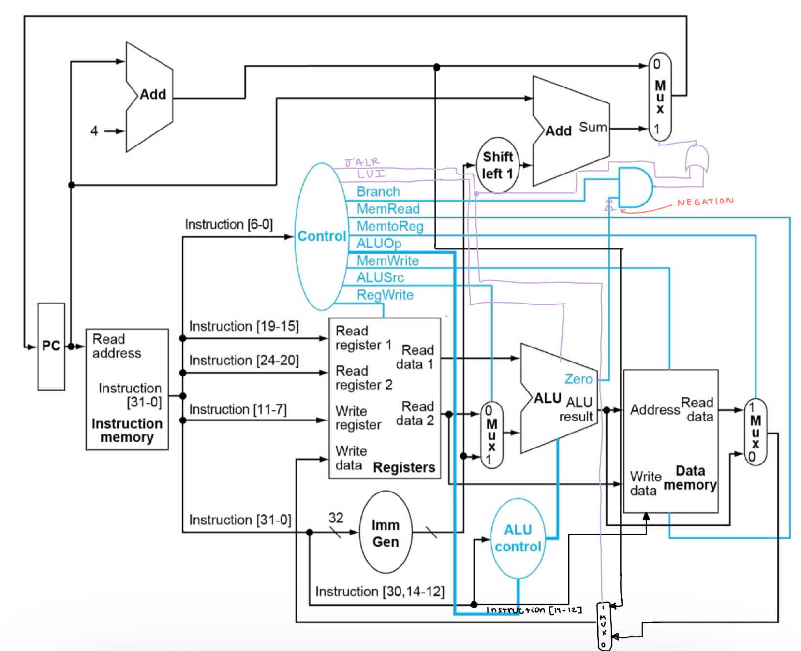

# Table of Contents
- [Table of Contents](#table-of-contents)
- [Single-Cycle Processor Design](#single-cycle-processor-design)
  - [Instructions and Implementations](#instructions-and-implementations)
  - [Control Signal Table](#control-signal-table)
- [Building](#building)
- [Testing](#testing)

# Summary

This project is an implementation and simulation of a Single-Cycle Processor Design supporting the RISC-V 32 ADDI, LUI, ORI, SLTIU, SRA, SUB, AND, LBU, LW, SH, SW, BNE, JALR instructions.

# Single-Cycle Processor Design

Design heavily adapted from the single-cycle processor design in the following literature:

David A. Patterson and John L. Hennessy. 2017. Computer Organization and Design RISC-V Edition: The Hardware Software Interface (1st. ed.). Morgan Kaufmann Publishers Inc., San Francisco, CA, USA.

The design supports the following instructions.

## Instructions and Implementations

ADDI

- already supported in preexisting design

LUI

- I added a new 1 bit control signal coming from the controller called LUI, which is high if the instruction is an LUI instruction and low otherwise. This signal is fed into the ALU. We assume that the Imm Gen can parse the upper immediate out from the full immediate and send this to the MUX connected to the ALU. Then, if the LUI signal is 1, the ALU will simply not perform any operation and instead just output the immediate. Otherwise, the ALU will perform the operation as given by the ALU control signal.

ORI

- already supported in preexisting design

SLTIU

- Nothing visually was added in the design, but in implementation, the ALUOp signal is widened to be 3 bits wide so that a new enumeration can be represented for SLTIU. When the ALU Control sees that its signal is SLTIU, it will instruct the ALU to perform rs1 - imm and output 1 if the result is < 0 and 0 otherwise.

SRA

- Nothing visually was added in the design, but in implementation, the ALUOp signal is widened to be 3 bits wide so that a new enumeration can be represented for SRA. When the ALU Control sees that its signal is SRA, it will instruct the ALU to perform a right shift (assume that the ALU has this capability implemented) on rs1 using the bottom 4 bits of rs2

SUB

- already supported in preexisting design

AND

- already supported in preexisting design

LBU

- In order to differentiate between LW and LBU, the memory unit needs to know funct3, which is given by Instruction[14-12], so a wire is added accordingly from the Instruction to the memory unit. Then, the memory unit will read the single byte from memory accordingly and output a zero-extended version to the MUX.

LW

- already supported in preexisting design

SH

- In order to differentiate between SW and SH, the memory unit needs to know funct3, which is given by Instruction[14-12], so a wire is added accordingly from the Instruction to the memory unit. Then, the memory unit will store the lower 16 bits of rs2 (rs2[15:0]) into the memory address.

SW

- already supported in preexisting design

BNE

- Since the only branch instruction this design needs to support is BNE, I simply add a negation to the zero line from the ALU into the AND gate → this makes it so that if the comparison between rs1 and rs2 is not equal AND the instruction is a branch instruction, a branch will be taken.

JALR

- I add a new control signal JALR from the controller, which is 1 if the instruction is jalr and 0 otherwise. I wire this to a MUX which takes PC + 4 (wired from the adder for PC + 4) as one input and the result of the MUX after the memory unit as the other input. If the jalr control signal is 1, it will output PC + 4 to the write data line of the register file. Otherwise, it will output the result of the other MUX to the write data line of the register file. Notice that the MUX after the memory unit no longer is directly connected to the register file.
- Then, JALR is also connected to a new and OR gate. The result of the AND gate taking in the branch signal and the zero line from the ALU is also connected to the OR gate. The result of the OR gate is now the input of the MUX deciding whether to set PC to PC + 4 or PC + Imm. Therefore, if the instruction is JALR OR branch AND the zero line is not 0, PC will be set to PC + Imm. Otherwise, PC will be set to PC + 4 as normal.

## Control Signal Table

I define the ALUSrc mapping as follows:

ADD = 000 (LW and SW), SUB = 001 (BNE), r-type = 010, i-type = 011, sltiu = 100, sru = 101

Resulting control signal table:

|  | JALR | LUI | Branch | MemRead | MemtoReg | MemWrite | ALUSrc | RegWrite | ALUOp |
| --- | --- | --- | --- | --- | --- | --- | --- | --- | --- |
| R-type (SUB, AND) | 0 | 0 | 0 | 0 | 0 | 0 | 0 | 1 | 010 |
| I-type (ADDI, ORI) | 0 | 0 | 0 | 0 | 0 | 0 | 1 | 1 | 011 |
| lw/lbu | 0 | 0 | 0 | 1 | 1 | 0 | 1 | 1 | 000 |
| sw/sh | 0 | 0 | 0 | 0 | 0 | 1 | 1 | 0 | 000 |
| bne | 0 | 0 | 1 | 0 | 0 | 0 | 0 | 0 | 001 |
| jalr | 1 | 0 | 0 | 0 | 0 | 0 | 0 | 1 | (any) |
| lui | 0 | 1 | 0 | 0 | 0 | 0 | 1 | 1 | (any) |
| sltiu | 0 | 0 | 0 | 0 | 0 | 0 | 1 | 1 | 100 |
| sra | 0 | 0 | 0 | 0 | 0 | 0 | 1 | 1 | 101 |

# Building

To test this simulator, the binary file was compiled using g++ (gcc version 15.2.0).

You may run `g++ *.cpp -o cpusim` to compile the binary.

Then, run `./cpusim <inputfile.txt>` on an assembly file of your choice. (See Testing for details of format)

# Testing

Sample test cases are provided in the trace/ directory

The test cases are formatted as .txt files with 2 hex values representing a single byte occupying each line. (i.e. each byte is separated by a newline)
